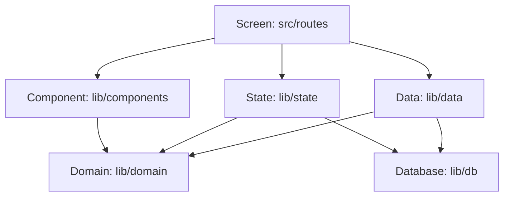

[Wiki](../README.md) / [Code](README.md) / The layers

# The layers

A layer is a group of files with the same kind of job. The rule between the layers is one sentence: a file imports only from its own layer or from a layer below it.

## Why the direction is important

If a rule of the kitchen imports a component, you cannot change the component without a risk to the rule. If the imports go one way only, a change at the top cannot break the bottom. You can also read the bottom layers with no knowledge of the screens.

## The five layers

| Layer     | Folder           | Its job                                                    | It does not                       |
| --------- | ---------------- | ---------------------------------------------------------- | --------------------------------- |
| Screen    | `src/routes`     | Gathers the data of one page and connects taps to actions. | Calculate, or touch the database. |
| Component | `lib/components` | Shows the data that it gets, and tells what the owner did. | Start a query.                    |
| State     | `lib/state`      | Keeps data live: queries that update, the clock.           | Write to the database.            |
| Domain    | `lib/domain`     | The rules of the kitchen, as pure functions.               | Know the database or the screen.  |
| Data      | `lib/data`       | Reads and writes the database, in transactions.            | Know the screen.                  |

A pure function gives the same answer for the same input, and changes nothing. `shoppingNeeds(menu, recipes, pantry)` is pure: it gets lists and gives a list.

The tools for the device are below all layers: gestures in `lib/input`, motion in `lib/motion`, sound in `lib/sound`, and small tools in `lib/util`. A component or a screen can use them.

## An example: the shopping list

- `domain/shopping.js` calculates what the menu needs and the pantry does not have.
- `data/shopping-items.js` adds an item that you type by hand.
- `state/shopping.svelte.js` keeps the list current while the screen is open.
- `routes/shop/+page.svelte` gives the list to `ShoppingRow`, and calls `take()` on a tap.

## The lint checks the direction

The rule is not only on this page. The ESLint configuration has a `no-restricted-imports` rule for each layer. A component that imports `$lib/db/db` is an error in `npm run lint`. So the structure cannot drift while nobody looks.

## Further reading

- [One kitchen](one-kitchen.md): the one state module that a component can ask for by name.
