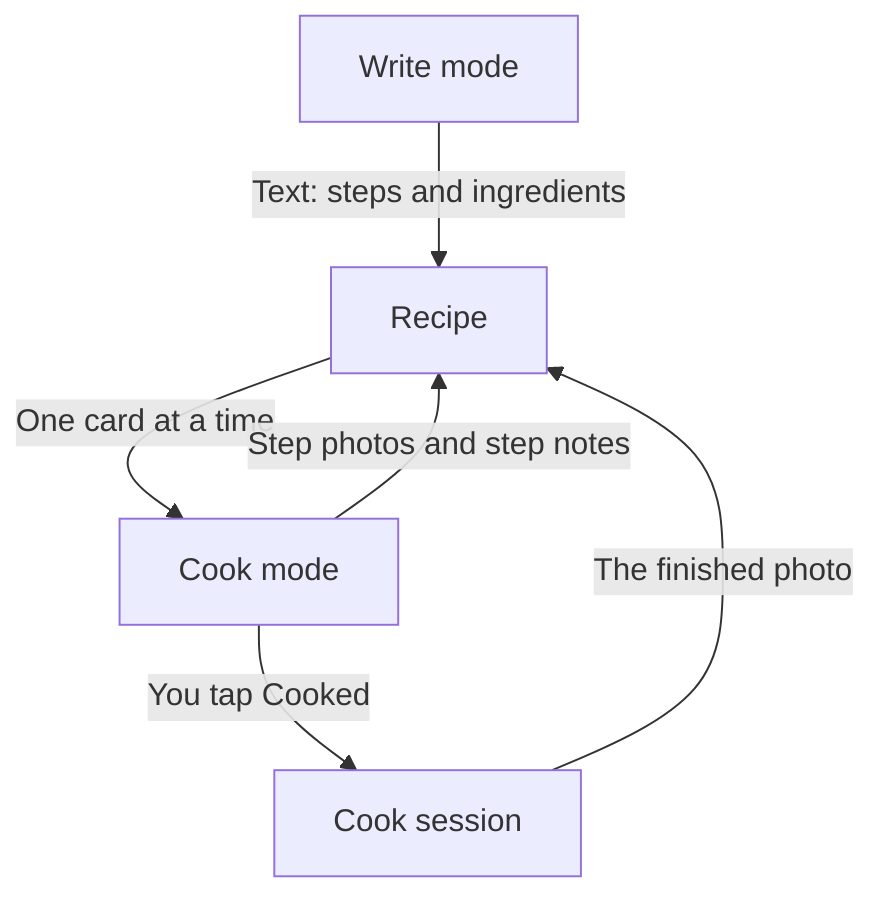

[Wiki](../README.md) / Recipes

# Recipes

Recipes is the part of the app where you write a meal down and where you cook it. This page gives the full picture. Each part has its own page.

## The problem

You use a recipe in two places. At a desk, you have a keyboard and time. At the stove, your hands are wet, the phone is on the counter, and you must not lose your place. One screen cannot be good for the two.

## The answer: one recipe, two modes

- **In [Write mode](write-mode.md)** you only type. A recipe is a name, a list of steps, and a list of ingredients.
- **In [Cook mode](cook-mode.md)** you only tap. One step fills the screen, in large text. The screen stays on.

The app makes the connection between the two. It [reads the text of each step](step-text.md) and finds the times and the ingredients. So the step "Cook the rice for 12 minutes" gets a [timer](timers.md) and shows "Rice, 300 g". You set up nothing.

## The recipe gets better each time you cook

The photos come from the stove, not from the desk. While you cook, one tap on the camera adds a [step photo](step-photos.md). One more tap adds a [step note](step-notes.md), such as "Less salt". At the end, the app asks for a [photo of the finished meal](finished-photo.md). The next time, the recipe shows all of this.

Each time you cook, the app also makes a [cook session](cook-session.md): a record of when, how long, and how good.

## An example

You type "Chicken curry" on the desktop: five steps and four ingredients.

1. You [share the recipe](share-a-recipe.md) to the phone as one file.
2. On Friday you cook it. You take a photo of the browned chicken, and a photo of the plate.
3. The photo of the plate is now the cover of the recipe. The next time, step 3 shows the photo of the chicken.

## Further reading

- [Data model](data-model.md): where the steps, the photos, and the cook sessions are stored.
- [Glossary](glossary.md): the meaning of each word.
