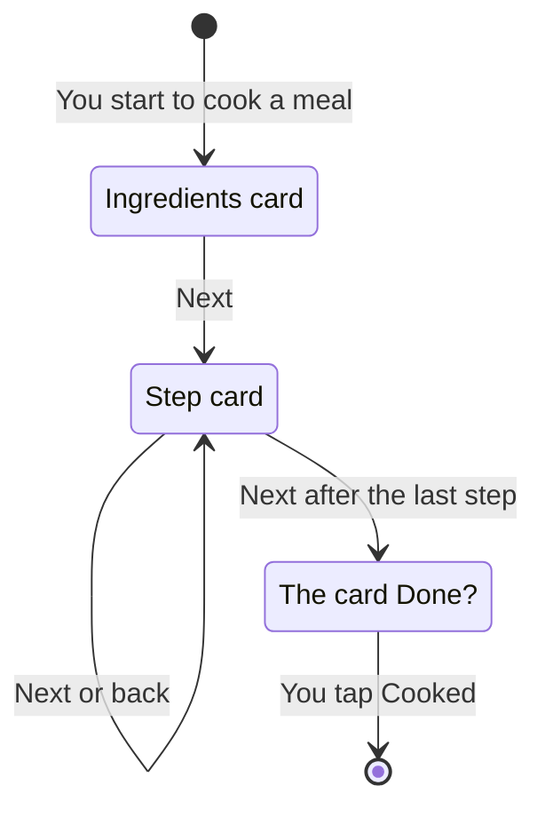

[Wiki](../README.md) / [Recipes](README.md) / Cook mode

# Cook mode

At the stove you have wet hands and little attention for a screen. Cook mode shows one thing at a time, in large text, and you move with one tap.

## One card at a time

Cook mode is a row of cards. One card fills the screen.

**The ingredients card** is a checklist of all ingredients with their quantities. You tap each one when it is on the counter. So you find that the cream is gone before the pan is hot.

**A step card** shows one step: its text, its [photo](step-photos.md), the ingredients that [the app found in the text](step-text.md), and a button for each [timer](timers.md). It also shows each [note](step-notes.md) that you wrote on this step before.

**The last card** is olive and asks "Done?". It lists what "Cooked" takes from the pantry, for example "Rice −300 g", so you see the result before you tap. If the meal used more or less, "Change amounts" makes each amount a field. A row shows "Takes all" when the pantry has less than the amount. "Cooked" is a large button on this card. The screen after it asks for a [photo of the meal](finished-photo.md).

## How you move

A tap on the right half of the card goes to the next card. A tap on the left half goes back. A swipe does the same, and so do the arrow keys. The target is half of the card, so a knuckle is sufficient. The card has no "Back" and "Next" buttons: a small hint at its bottom edge, "Step 1 →", shows where to tap.

## The screen stays on

A phone turns its screen off after a short time. In Cook mode, the app asks the browser to keep it on. You do not unlock the phone with flour on your fingers.

## The app keeps your place

When Cook mode starts, the app makes a [cook session](cook-session.md) and records each card that you open. If you leave to answer a message, the meal on the Today screen shows "Continue". You come back to the same card.

## You do not have to use it

For a meal that you know from memory, "Cooked" on the Today screen does the work of the last card in one tap, with the amounts of the recipe.

## An example

You cook the chicken curry. The ingredients card shows four rows. Step 2 shows "Rice, 300 g" and a "12:00" button. The last card shows "Rice −300 g". You used less, so you tap "Change amounts", type 250, and tap "Cooked".

## Further reading

- [Write mode](write-mode.md): where the text of the cards comes from.
