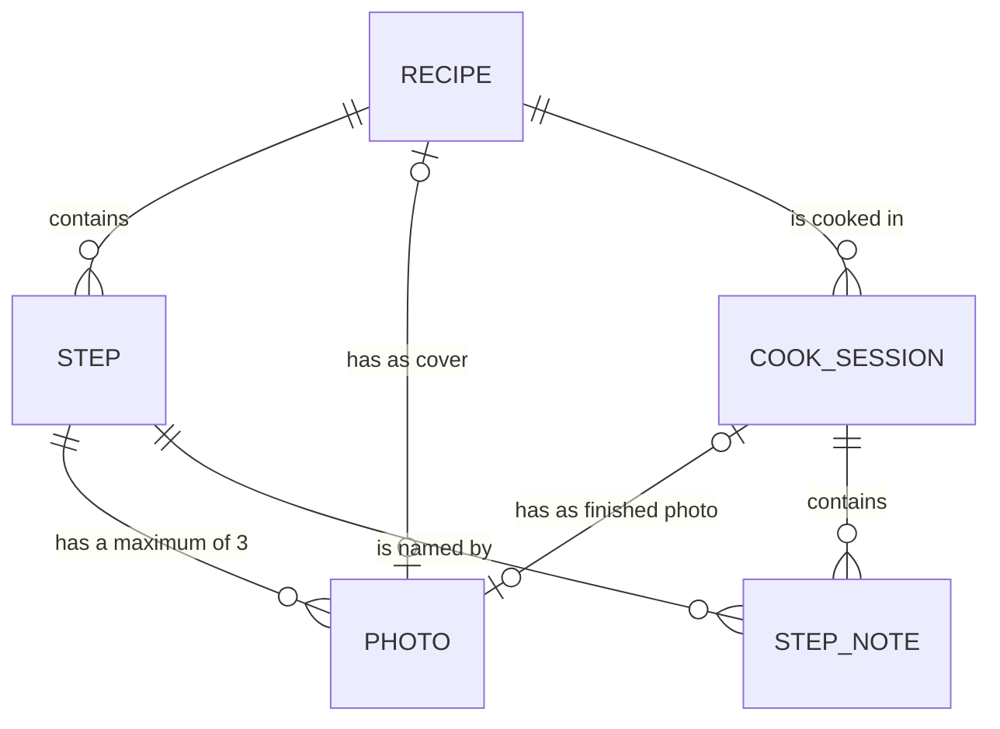

[Wiki](../README.md) / [Recipes](README.md) / Data model

# Data model

This page shows where a recipe, its steps, its photos, and its cook sessions are stored, and how they connect. All of them are in the [database on the phone](../shopping/photo-storage.md).

Read a line as a sentence: one recipe contains zero or more steps.

## Three tables

| Table         | One row is                                                                     | Important fields                                                                                         |
| ------------- | ------------------------------------------------------------------------------ | -------------------------------------------------------------------------------------------------------- |
| Recipes       | One meal that you can cook.                                                    | The name, the ingredients with their quantities, the steps, the cover, the time of the last text change. |
| Photos        | One picture.                                                                   | The bytes, and the time when you took it.                                                                |
| Cook sessions | One time that you cooked one recipe. See [what it remembers](cook-session.md). | The recipe, the start and the end, the finished photo, the step notes.                                   |

The photos table is the same table that holds the [photos of products](../shopping/data-model.md). A photo does not know what it shows. The row that uses the photo has its ID.

## A step is not a table

The steps are a list inside the recipe row. The app always reads a recipe and its steps together. One row is also simple to put in a [recipe file](share-a-recipe.md).

| Field of a step          | Example                                          |
| ------------------------ | ------------------------------------------------ |
| ID                       | s3                                               |
| Text                     | "Brown the chicken for 5 minutes."               |
| [Photos](step-photos.md) | f1, f2, f3: the IDs of a maximum of three photos |
| Selected photo           | f1                                               |

A step stores no timer and no ingredient. The app [reads them from the text](step-text.md).

## Why a step has an ID

The app could name a step by its number: "step 3". But you can put a new step before it, and then "step 3" is a different step. Its photos and its [notes](step-notes.md) would be on the wrong step.

So each step gets an ID when you make it, and the ID never changes. You can change the text and move the step, and its photos and notes stay with it.

The ID is also how [an import knows](merge.md) that a step on the desktop and a step on the phone are the same step.

## Further reading

- [How the photos stay light](photo-weight.md): how large the photos table can become.
- [Glossary](glossary.md): the meaning of each word in the tables.
