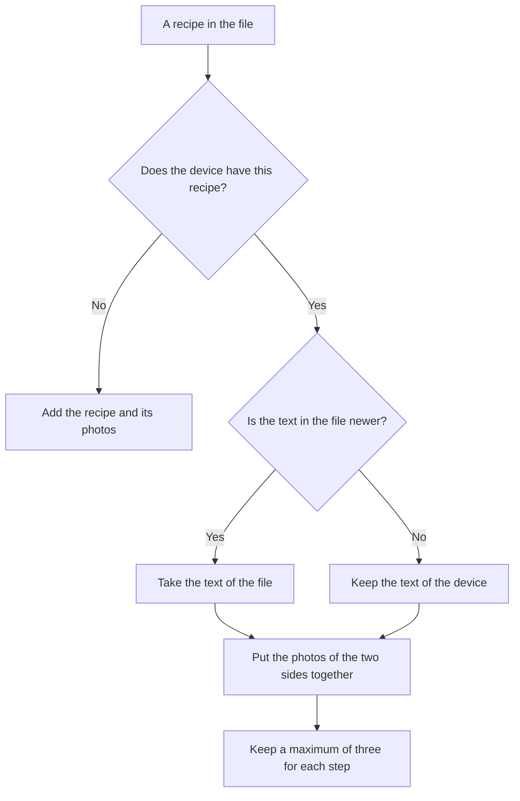

[Wiki](../README.md) / [Recipes](README.md) / [Data model](data-model.md) / [Share a recipe](share-a-recipe.md) / How an import merges a recipe

# How an import merges a recipe

The desktop and the phone each have a copy of the chicken curry. On the desktop, you correct a step. On the phone, you cook and add photos. Then a recipe file goes from one to the other. The import must keep the two changes.

## Text and photos have different rules

The text is one thing that you wrote on purpose, so one version must win. The photos are a collection, so the import can keep those of the two sides.

## The text: the newer one wins

Each recipe has the time of the last change of its text: the name, the ingredients, and the steps. The newer text wins as a whole.

A new photo does not change this time. So a cook on the phone never makes the phone newer than a correction on the desktop.

## The photos: the two sides, then the limit

For each step, the import puts the photos of the file and of the device together. It finds the step by [its ID](data-model.md), so a step with new text or a new position keeps its photos. Then it applies [the limit of three](step-photos.md).

Three cases have a rule.

- **The selected photo and the cover.** The choice of the device stays. If the device has none, the import takes the choice of the file.
- **A step that the newer text does not have.** The import deletes its photos with it.
- **An ingredient with the same name on the device.** The recipe uses that one. So "Rice" from the desktop is the rice of your pantry.

## An example

| Day      | Desktop                                                           | Phone                                     |
| -------- | ----------------------------------------------------------------- | ----------------------------------------- |
| Monday   | You type the recipe and share it.                                 | You import it.                            |
| Tuesday  | You change step 4 to "Simmer for 20 minutes."                     |                                           |
| Friday   |                                                                   | You cook. Step 3 gets photo A. You share. |
| Saturday | You import. Your text is newer, so it stays. Step 3 gets photo A. |                                           |

The desktop now has the two changes.

## Further reading

- [Backup](../shopping/backup.md): the other import, which replaces all data and does not merge.
