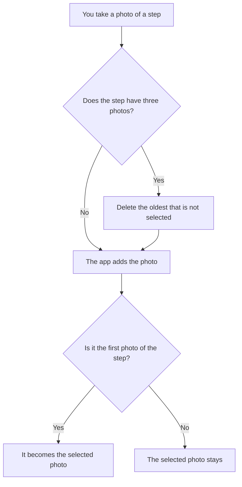

[Wiki](../README.md) / [Recipes](README.md) / [Cook mode](cook-mode.md) / Step photos

# Step photos

A photo tells what words cannot: how brown "browned" is. This page tells how a step gets its photos, and why it keeps three of them at the most.

## One tap, while you cook

Each step card in Cook mode has a camera button. A tap opens the camera. You take the photo, and the app saves it. There is no confirm screen, because your hands are busy.

Before the app stores the photo, it [makes the photo small](../shopping/photo-capture.md): about 60 KB.

## A step keeps three photos

If each new photo replaced the old one, a bad photo could remove a good one. If the app kept each photo, a recipe that you cook each week would [become heavy](photo-weight.md). So a step keeps a maximum of three.

One of the three is the **selected photo**: the photo that the step card shows. The first photo of a step is selected automatically. A new photo does not change the selection.

## What a new photo does

The app never deletes the selected photo automatically. The photo that you chose is safe.

## How you select

A tap on the photo of a step opens its photos side by side. A tap on one of them makes it the selected photo. You can also delete a photo here.

## An example

Step 3 is "Brown the chicken for 5 minutes."

| Moment          | The step has                | Selected |
| --------------- | --------------------------- | -------- |
| Cook 1: photo A | A                           | A        |
| Cook 2: photo B | A, B                        | A        |
| Cook 3: photo C | A, B, C                     | A        |
| You select C    | A, B, C                     | C        |
| Cook 4: photo D | B, C, D. The app deleted A. | C        |

A was the oldest photo that was not selected, so the fourth photo removed it.

## Further reading

- [Where a photo is stored](../shopping/photo-storage.md): the table that holds the bytes of each photo.
- [How an import merges a recipe](merge.md): what occurs when two devices have photos of the same step.
