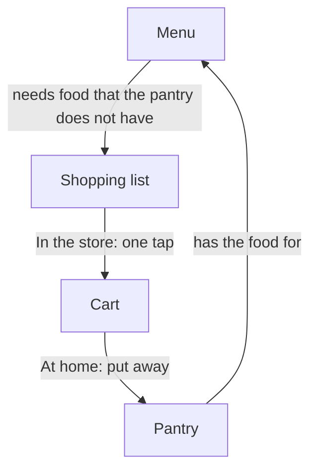

[Wiki](../README.md) / Shopping

# Shopping

Shopping is the part of the app that brings food from the store into the pantry. This page gives the full picture. Each part has its own page.

## The problem

A store is a bad place to type: you have one free hand and little time. But the pantry needs exact quantities, because the app uses them to tell you which meals you can cook. One step cannot be quick and exact.

## The answer: two moments

- **[In the store](in-the-store.md)** you only tap. A tap moves an item to the cart. You type no quantity and no price.
- **At home** you [put the items away](put-away.md). You have the package in your hand, so you can confirm the quantity. Then the item goes into the pantry.

Between the two moments, an item is in the cart and not in the pantry. This is one of the three states in [the journey of an item](item-journey.md).

## The app learns from each trip

A recipe asks for rice. You buy one exact [product](ingredient-and-product.md): your usual bag of rice. The first time, you give the app a [photo](photo-capture.md) of it, the package size, and the [price](prices-and-trips.md). The next time, you see the photo in the store, and one tap puts the rice away at home.

## An example

The menu has tacos and a curry. The list shows rice, limes, cream, and taco seasoning.

1. In the store, you tap each item. The taco seasoning shows three photos, because you buy three brands. You [choose the one](choose-product.md) that you take today.
2. At home, the app asks only how many limes you got. Each other item needs one tap.
3. The app shows the cost of the trip, and the menu shows that the two meals have all their food.

All of this works with [no connection](offline.md), because the data is on the phone.

## Further reading

- [Data model](data-model.md): the tables behind shopping.
- [Glossary](glossary.md): the meaning of each word.
