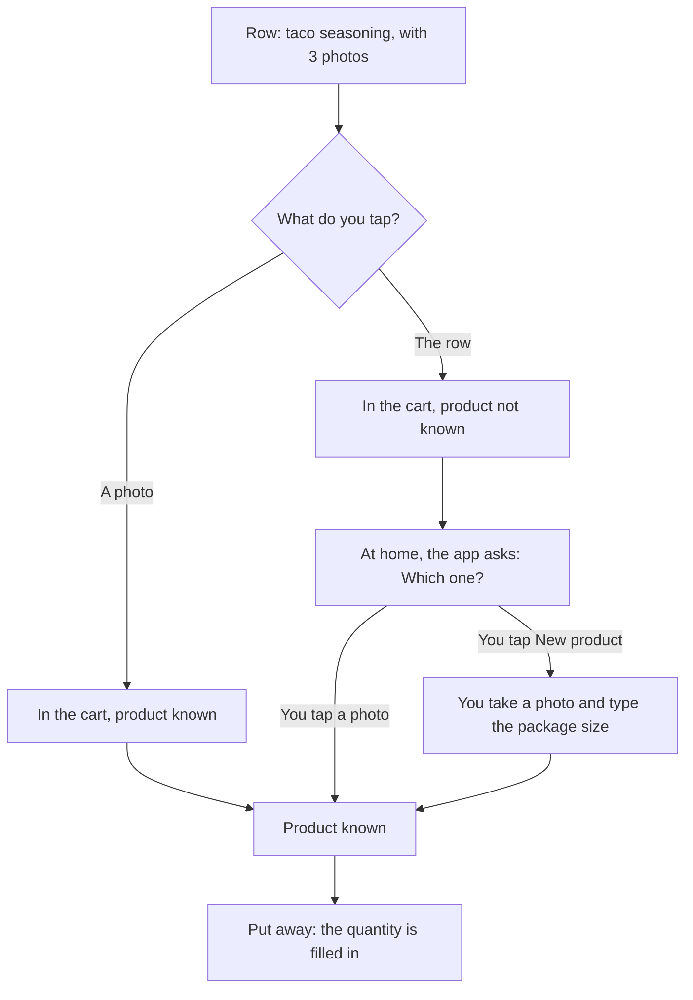

[Wiki](../README.md) / [Shopping](README.md) / [Ingredients and products](ingredient-and-product.md) / Choose a product

# Choose a product

An ingredient can have many products. This page tells how the app finds out which one is in your cart.

## You can choose at two moments

**In the store.** On the [shopping list](in-the-store.md), the row of an ingredient shows the photos of its products, the newest purchase first. A tap on a photo is the choice. This is optional: a tap on the row is quicker, and the app asks later.

**At home.** For an item with no product, [put away](put-away.md) shows the same photos and asks "Which one?".

## When the app does not ask

- The ingredient has only one product. The app proposes it.
- The app does not count the ingredient. It needs no package size, so the product is not important.

## A new product

The first time you buy something, there is no photo to tap. At home you select "New product". You do three things:

1. Take a photo of the package. The app [makes the photo small](photo-capture.md) before it stores it.
2. Type the package size, for example 1000 g. This is the only time that you type it.
3. Optional: scan the barcode, so that a scan finds the product the next time.

From then on, the product is on the row of its ingredient.

## What the choice does not change

The pantry gets taco seasoning, not a brand. If you select the incorrect photo, only the package size and the [price history](prices-and-trips.md) can be incorrect. You can correct the quantity before you confirm.

## Further reading

- [Where a photo is stored](photo-storage.md): why the photos on a row show with no connection.
