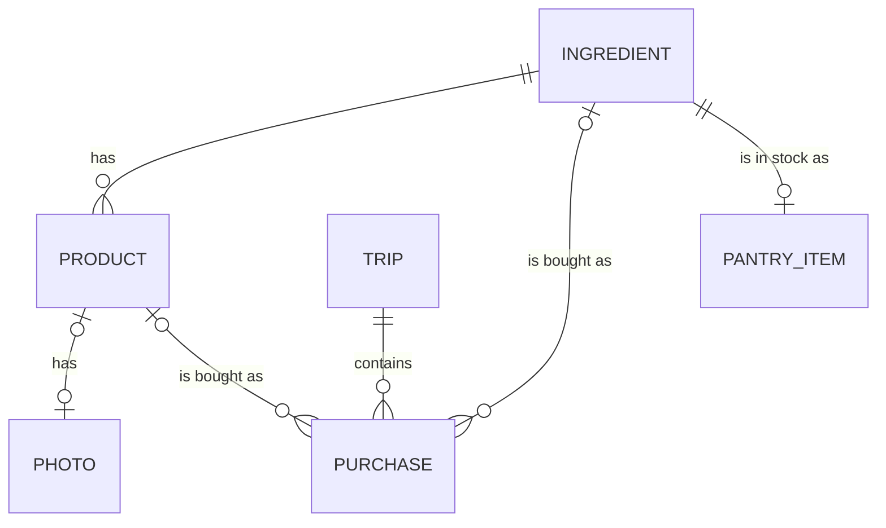

[Wiki](../README.md) / [Shopping](README.md) / Data model

# Data model

This page shows the tables behind shopping and how they connect. All of them are in the database [on the phone](offline.md).

Read a line as a sentence: one ingredient has zero or more products.

## The tables

| Table     | One row is                                                                            | Important fields                                                                                                                                   |
| --------- | ------------------------------------------------------------------------------------- | -------------------------------------------------------------------------------------------------------------------------------------------------- |
| Products  | One exact item on a shelf. See [ingredients and products](ingredient-and-product.md). | The ingredient, the name, the package size, the photo, the barcode (optional).                                                                     |
| Photos    | The picture of one product. See [where a photo is stored](photo-storage.md).          | The bytes.                                                                                                                                         |
| Trips     | One visit to a store. See [prices and trips](prices-and-trips.md).                    | The start time, and the time when the cart became empty.                                                                                           |
| Purchases | One item in one trip.                                                                 | The trip, the ingredient, the product (if known), the number of packages, the quantity, the price, the time in the cart, the time it was put away. |

## The cart is not a table

There is no cart table. The cart is a question to the purchase table: "which purchases are not put away?".

One purchase row follows the item through [its full journey](item-journey.md).

| Moment                                | What occurs to the row                                                                               |
| ------------------------------------- | ---------------------------------------------------------------------------------------------------- |
| A tap [in the store](in-the-store.md) | The app makes the row. The quantity, the price, and the put-away time are empty.                     |
| Undo                                  | The app deletes the row.                                                                             |
| [Put away](put-away.md)               | The app fills in the quantity, the price, and the put-away time. It adds the quantity to the pantry. |

The advantage is that nothing is copied. The record that was the cart item is the history record.

## The shopping list is not a table

The app calculates the list: the ingredients of the menu, minus the pantry. Only an item that you add by hand, such as soap, is a stored row. Soap is not an ingredient, so its purchase has a name and a price, and it does not go into the pantry.

All these tables go into one file when you make a [backup](backup.md).

## Further reading

- [Glossary](glossary.md): the meaning of each word in the tables.
