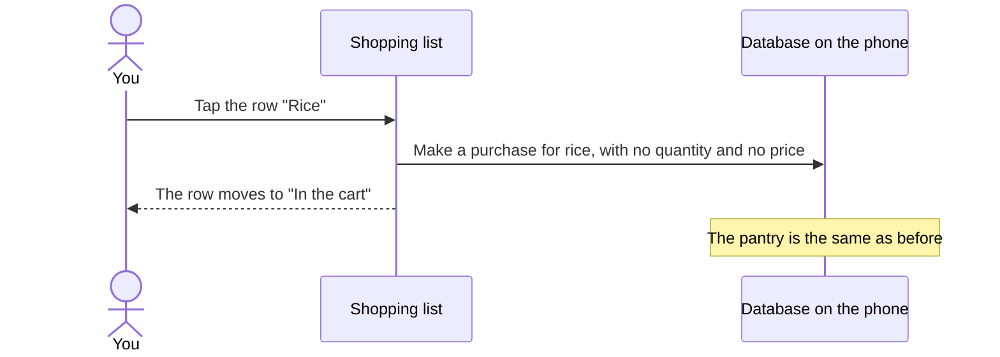

[Wiki](../README.md) / [Shopping](README.md) / [The journey of an item](item-journey.md) / In the store

# In the store

You use this screen with one hand, between the shelves. So each action is one tap, and nothing needs the keyboard. The screen also works with [no signal](offline.md).

## The parts of the screen, from top to bottom

| Part        | What it shows                                                                                                                                                                                                                                             | What a tap does                                    |
| ----------- | --------------------------------------------------------------------------------------------------------------------------------------------------------------------------------------------------------------------------------------------------------- | -------------------------------------------------- |
| Meals       | A small photo of each meal on the menu, with "2 to buy" or "ready".                                                                                                                                                                                       | Shows only the items of that meal.                 |
| Progress    | One line, for example "3 of 8 in the cart".                                                                                                                                                                                                               | Nothing.                                           |
| Aisles      | The needed items in groups: produce, dairy, dry goods, and so on. The groups are in the sequence of a store. Each row has the name, the quantity that the menu needs, and the photos of the [products](ingredient-and-product.md) that you bought before. | Puts the item in the cart.                         |
| In the cart | The items that you took, each with a line through it.                                                                                                                                                                                                     | "Undo" puts the item back. "2×" sets two packages. |
| Add an item | One text field at the bottom.                                                                                                                                                                                                                             | Adds an item that no meal needs, such as soap.     |

A meal shows "ready" here before it does on the Menu screen. The reason is in [what the screens count](item-journey.md).

## What one tap does

The [purchase](data-model.md) is a small record: which ingredient, when, and how many packages. It is the start of the history of this item. You complete it when you [put the item away](put-away.md).

## Three ways to put an item in the cart

1. **Tap the row.** The quickest way. The app does not know which product you took.
2. **Tap a photo on the row.** You [choose the exact product](choose-product.md). The app then knows its package size and its [last price](prices-and-trips.md).
3. **Scan the barcode.** The same result as a tap on the photo.

## The end of the trip

When the last item is in the cart, the progress line tells you that you have all items. The meals at the top all show "ready".

## Further reading

- [Glossary](glossary.md): the exact meaning of "cart", "purchase", and "package".
