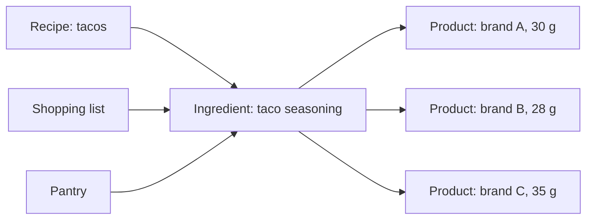

[Wiki](../README.md) / [Shopping](README.md) / Ingredients and products

# Ingredients and products

The app has two words for food, and the difference is important.

- An **ingredient** is the food as a recipe sees it: "taco seasoning".
- A **product** is one exact item on a shelf: "Brand B taco seasoning, 28 g".

## Why two levels

You buy three brands of taco seasoning. The choice depends on the price and on what you like that day. The taco recipe must work with each of them. It needs taco seasoning, not a brand.

The left side of the diagram knows only the ingredient. Recipes, the shopping list, and the pantry never refer to a brand. The right side is the memory of what you buy.

## Which data is where

| Data                   | It is on the | Reason                                                                                                                                 |
| ---------------------- | ------------ | -------------------------------------------------------------------------------------------------------------------------------------- |
| Name, unit, aisle      | Ingredient   | A recipe and the shopping list need them.                                                                                              |
| Quantity in the pantry | Ingredient   | The pantry has one sum. 30 g of brand A and 28 g of brand B are 58 g of taco seasoning.                                                |
| Package size           | Product      | Each brand has a different package.                                                                                                    |
| Photo                  | Product      | The photo shows the exact item to look for. The app [makes it small](photo-capture.md) and [stores it on the phone](photo-storage.md). |
| Barcode                | Product      | Optional. A scan finds the product.                                                                                                    |
| Price                  | Purchase     | A price changes with time, so [each purchase keeps its price](prices-and-trips.md).                                                    |

## The rules

- One product is one ingredient.
- One ingredient can have many products, or none.
- A product does not need a barcode. A photo and a package size are sufficient.

## What you get from products

[In the store](in-the-store.md), the photos on a row tell you what to look for, and a tap on one lets you [choose that product](choose-product.md). At home, a known product tells the app the quantity, so [put away](put-away.md) needs one tap.

## Further reading

- [Data model](data-model.md): the product table and its links.
- [Glossary](glossary.md): the exact meaning of "package" and "package size".
