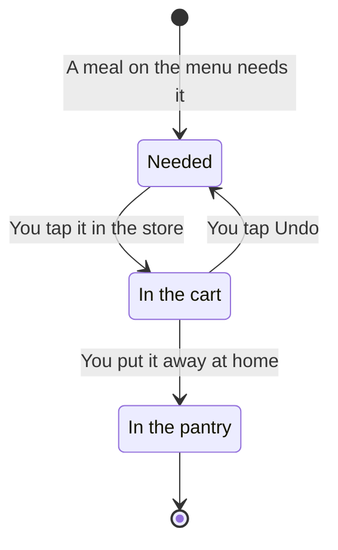

[Wiki](../README.md) / [Shopping](README.md) / The journey of an item

# The journey of an item

Each item on the shopping list is in one of three states.

## The three states

**Needed.** The app calculates this state. It adds the ingredients of all meals on the menu, and subtracts what the pantry has. What remains is the shopping list.

**In the cart.** You took the item [in the store](in-the-store.md). The app made a record of it, a [purchase](data-model.md), but the pantry is the same as before. The app does not know the exact quantity yet.

**In the pantry.** You confirmed the quantity when you [put the item away](put-away.md). Now the pantry has it, and the item is gone from the list.

## Why "in the cart" is not "in the pantry"

A number in the pantry must be a number that you checked. If a tap in the store filled the pantry, the app would guess the quantity. Then a recipe could tell you that you have 500 g of rice when the package had 1000 g.

## What the screens count

Two screens count differently, and this is correct.

| Screen         | It counts                                                                        | Reason                                           |
| -------------- | -------------------------------------------------------------------------------- | ------------------------------------------------ |
| Menu and Today | Only the pantry. A meal shows "7/9" until you put the items away.                | These screens answer "can I cook this now?".     |
| Shopping list  | The pantry and the cart. A meal shows "ready" when its last item is in the cart. | This screen answers "can I go to the checkout?". |

## Special cases

- **You remove a meal while its items are in the cart.** The items stay in the cart. You have them, so you put them away.
- **You do not find an item.** It stays "needed". It is on the list at the next trip.

## Further reading

- [Prices and trips](prices-and-trips.md): what else the app does with the record of an item.
- [Glossary](glossary.md): the exact meaning of "needed", "cart", and "put away".
