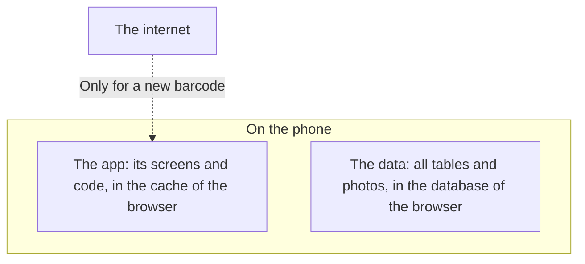

[Wiki](../README.md) / [Shopping](README.md) / [Data model](data-model.md) / Offline

# Offline

A store can have no signal. The [shopping list](in-the-store.md) must work there. This page tells why it does, and which steps do need a connection.

## Two things are on the phone

**The app.** The first visit puts the screens and the code into a cache. After that, the browser starts the app from the cache, with or without a connection.

**The data.** Each change goes into the [database on the phone](photo-storage.md). No step sends data to a server, because there is no server.

## What needs a connection

| Step                                                  | Connection                                                                                                           |
| ----------------------------------------------------- | -------------------------------------------------------------------------------------------------------------------- |
| Open the shopping list                                | No                                                                                                                   |
| Put an item in the cart                               | No                                                                                                                   |
| See the photos of your products                       | No                                                                                                                   |
| Take a photo of a [new product](choose-product.md)    | No                                                                                                                   |
| Scan the barcode of a product that you scanned before | No                                                                                                                   |
| Scan the barcode of a new product                     | Useful. The app asks a public product database for the name and the package size. With no connection, you type them. |
| [Put away](put-away.md), with prices                  | No                                                                                                                   |
| Make a backup                                         | No                                                                                                                   |

## What you give up

The data is on one phone.

- A second phone does not see your cart or your pantry.
- If the phone is lost, the data is lost. The [backup](backup.md) is the protection.

A copy on a server is a later step of the project. It would add sync between phones, and it would not change how shopping works.

## Further reading

- [How a photo becomes small](photo-capture.md): a step that you could expect to need a server, and that does not.
