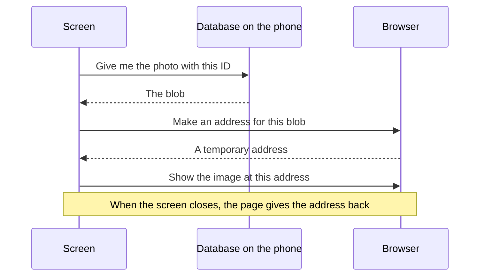

[Wiki](../README.md) / [Shopping](README.md) / [Ingredients and products](ingredient-and-product.md) / Where a photo is stored

# Where a photo is stored

The app has no server. All data is in a database that the browser keeps on the phone, and the photos are there too. This is why the app works [offline](offline.md).

## The database on the phone

Each browser has a database for each site, with the name IndexedDB. It stores records, and a record can contain a block of bytes. So a photo needs no file system and no upload: the [small blob](photo-capture.md) goes into a record. That record is the photo itself: there is no file in a different place.

The photos have their own table in the [data model](data-model.md). A product has only the ID of its photo.

| Table    | It has                                               |
| -------- | ---------------------------------------------------- |
| Products | The name, the package size, and the ID of the photo. |
| Photos   | The ID and the bytes of the picture.                 |

The reason is speed. A screen that lists 50 products reads the product table and gets no photo bytes. It reads a photo only when the photo comes into view.

The tools of the browser do not show the picture of a photo row. They show the blob as a size and a type: about 60 000 bytes, "image/jpeg". Those bytes are the picture.

## How a screen shows a photo

An image on a page needs an address. A blob in the database has none. So the page asks the browser for a temporary address.

The address is good only while the page is open. The app never stores it. When the screen closes, the page gives the address back, so that the browser can release the memory.

## How much space

| Photos | Space       |
| ------ | ----------- |
| 100    | About 6 MB  |
| 500    | About 30 MB |

A browser lets one site use a large part of the free disk, so the space is not a limit. The app also asks the browser to keep its data when the disk is almost full.

## One copy

The phone has the only copy of a photo. If the phone breaks, the photos are gone. So the [backup](backup.md) contains them.

## Further reading

- [Choose a product](choose-product.md): where you see the photos.
