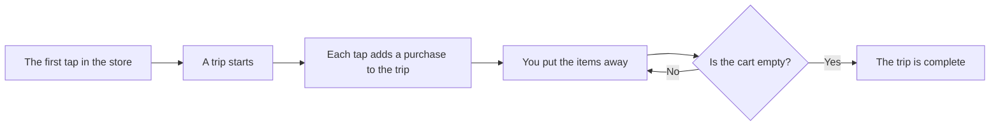

[Wiki](../README.md) / [Shopping](README.md) / Prices and trips

# Prices and trips

The app can tell you what a shopping trip cost and how the price of a product changed. It needs only one input from you: the price of an item, when you [put it away](put-away.md).

## The price is on the purchase

A [product](ingredient-and-product.md) has no price field. Each [purchase](data-model.md) has one. The reason is that a price changes. If the product had one price, a new price would erase the old one.

| Purchase     | Date         | Price of one package |
| ------------ | ------------ | -------------------- |
| Rice, 1000 g | 12 September | 2.29                 |
| Rice, 1000 g | 26 September | 2.49                 |
| Rice, 1000 g | 3 October    | 2.49                 |

From this history the app gets two things. The **last price** is the price of the newest purchase: "Put away" fills it in for you. The **price history** is the full list.

The price is for one package. If you took two packages, the cost of that line is two times the price.

## A trip

A trip is one visit to a store.

There is one open trip at a time. It starts with the first tap [in the store](in-the-store.md) and ends when the cart is empty.

## The cost of a trip

The cost is the sum of all lines that have a price. The price is optional, so some lines can have none. The app does not hide this.

> 3 October: 42.80, and 3 items with no price.

So you know that the true cost is higher, and by how many items.

## What you can learn

- What each trip cost, and your [spending by week](spending-by-week.md).
- If the rice was cheaper the last time.
- How much of an ingredient you buy each time. "Put away" uses this to propose a quantity.

All prices are in one currency. The app has no budget and no charts, but the data permits them.

## Further reading

- [Backup](backup.md): how the price history moves to a new phone.
- [Glossary](glossary.md): the exact meaning of "purchase", "trip", and "last price".
