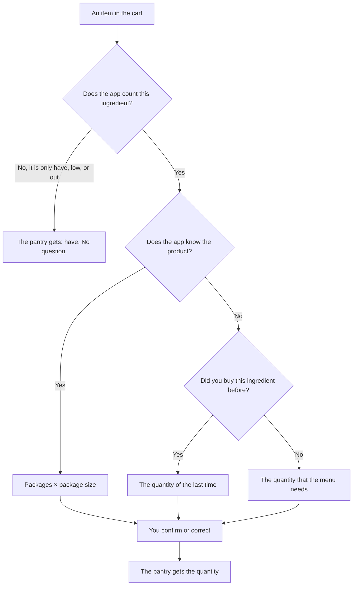

[Wiki](../README.md) / [Shopping](README.md) / [The journey of an item](item-journey.md) / Put away at home

# Put away at home

"Put away" is the second moment of shopping. You are at home, the bags are on the table, and you have time. The screen shows each item that you put in the cart [in the store](in-the-store.md), with a quantity that the app proposes. You confirm it or you correct it.

While the cart has items, the Today screen reminds you, for example "8 items wait to be put away".

## How the app proposes a quantity

The app uses the best information that it has. The best is a known [product](ingredient-and-product.md), because a product has a package size.

## Three examples

| Item      | What the app knows                                              | What you do                                      |
| --------- | --------------------------------------------------------------- | ------------------------------------------------ |
| Rice      | You tapped the photo of your usual rice. One package is 1000 g. | One tap. The pantry gets 1000 g.                 |
| Limes     | No product. The last time you bought 4.                         | The app proposes 4. You got 6, so you change it. |
| Olive oil | The app does not count it. It only knows have, low, or out.     | Nothing. The pantry is set to "have".            |

When an ingredient has more than one product and the app does not know which one you took, it asks you to [choose a product](choose-product.md) first.

## Use within, and "Not bought"

For food that can spoil, the card asks one more thing: "Use within". The app proposes the usual days of the food, and your answer is [the use-by date](use-by-date.md) of the item in the pantry.

"Not bought" is for a wrong tap in the store, or for a store that had none. The line leaves the receipt and its total, and the item goes back on the shopping list.

## The price

Each row has a price field. It is optional. The app fills in the last price of the product, so you type only when the price is different. You can read the prices from the receipt. The app uses them for [the cost of the trip](prices-and-trips.md).

## When you have no time

One button puts all items away with the proposed quantities. The numbers are then less exact, but the cart is empty and the menu is correct.

## Further reading

- [The journey of an item](item-journey.md): why this step is not a part of the tap in the store.
- [Data model](data-model.md): what "put away" writes into the database.
